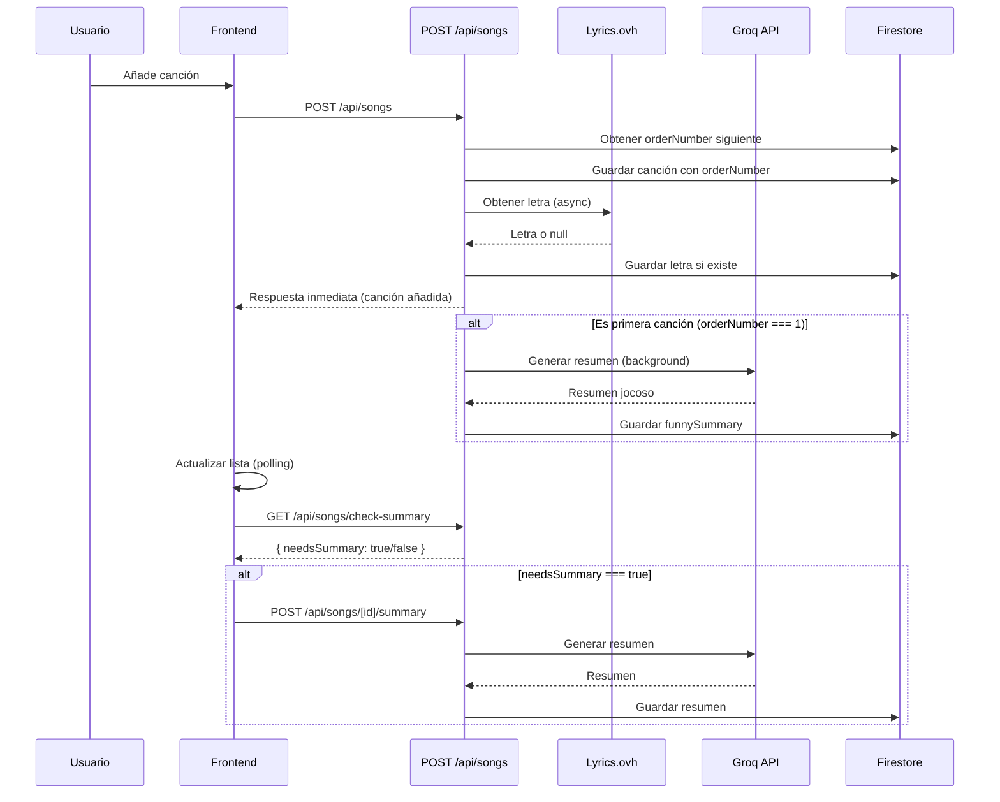

# Plan: Letras automáticas y resumen jocoso con Groq

## Resumen de funcionalidades

1. **Obtención automática de letras**: Al añadir canción, obtener letra automáticamente desde Lyrics.ovh API.
2. **Indicador de orden**: Mostrar número secuencial (1, 2, 3...) en cada canción de la lista.
3. **Resumen jocoso asíncrono**: Generar resumen con Groq para la primera canción de la cola, mostrarlo en la parte inferior de la columna derecha.
4. **Actualización automática**: Cuando el admin elimina la primera canción, generar resumen para la nueva primera.

---

## Cambios en estructura de datos (Firestore)

**Colección `queue**` - Añadir campos:

- `orderNumber` (number): Número secuencial asignado al añadir (1, 2, 3...)
- `lyrics` (string, opcional): Letra obtenida de Lyrics.ovh
- `funnySummary` (string, opcional): Resumen jocoso generado por Groq
- `summaryGeneratedAt` (timestamp, opcional): Cuándo se generó el resumen

**Colección `summaryGeneration**` (nueva, para tracking):

- Documento único: `current` con campo `firstSongId` (string): ID de la canción que actualmente tiene el resumen visible

---

## Archivos a crear/modificar

### Nuevos archivos

1. `**lib/lyrics-ovh.ts**`
  - Función `getLyrics(artist: string, songName: string): Promise<string | null>`
  - Llama a `https://api.lyrics.ovh/v1/{artist}/{title}`
  - Maneja errores (404, timeout) y retorna null si no hay letra
2. `**lib/groq-client.ts**`
  - Función `generateFunnySummary(lyrics: string): Promise<string | null>`
  - Llama a Groq API (`https://api.groq.com/openai/v1/chat/completions`)
  - Modelo: `llama-3.1-8b-instruct` (balance calidad/límites) o `llama-3.3-70b-versatile` (máxima calidad)
  - Prompt: "Eres un crítico musical divertido y con sentido del humor. Analiza esta letra de canción y haz un resumen jocoso y breve (máximo 3 frases) que capture la esencia de la canción con humor, sin ser ofensivo.\n\nLetra:\n{lyrics}\n\nResumen jocoso:"
  - Temperature: 0.8, max_tokens: 150
  - Maneja errores 429 (rate limit) y retorna null
3. `**app/api/songs/[id]/summary/route.ts**`
  - `POST`: Generar resumen jocoso para una canción específica
  - Verifica que la canción existe y tiene letra
  - Llama a Groq, guarda resultado en Firestore
  - Rate limit: 1 resumen cada 10 segundos por IP (usar `rate-limit-generic.ts`)
4. `**app/api/songs/check-summary/route.ts**`
  - `GET`: Verificar si la primera canción necesita resumen
  - Compara `firstSongId` en `summaryGeneration/current` con el ID de la primera canción
  - Si son diferentes, retorna `{ needsSummary: true, songId: "..." }`
  - Si son iguales pero no hay resumen, retorna `{ needsSummary: true, songId: "..." }`

### Archivos a modificar

1. `**app/api/songs/route.ts**`
  - **POST**: 
    - Obtener número de orden siguiente (contar documentos en `queue` + 1, o usar contador en Firestore)
    - Añadir campo `orderNumber` al documento
    - Intentar obtener letra con `getLyrics()` (asíncrono, no bloquear respuesta)
    - Guardar letra en `lyrics` si se obtiene
    - Si es la primera canción (orderNumber === 1), iniciar generación de resumen en background
  - **GET**:
    - Incluir `orderNumber`, `lyrics`, `funnySummary` en el tipo `QueueItem`
    - Ordenar por `orderNumber` en lugar de `createdAt` (o mantener ambos)
2. `**app/api/songs/[id]/route.ts**`
  - **DELETE**:
    - Después de eliminar, verificar si era la primera canción
    - Si era la primera, actualizar `summaryGeneration/current` con el nuevo `firstSongId`
    - Iniciar generación de resumen para la nueva primera canción (si tiene letra)
3. `**app/page.tsx**`
  - Añadir `orderNumber`, `lyrics`, `funnySummary` al tipo `QueueItem`
  - Mostrar `orderNumber` en cada item de la lista (ej: "1. Canción — Artista")
  - En la columna derecha (donde está la lista), añadir sección al final:
    - Título "Resumen jocoso"
    - Mostrar `funnySummary` de la primera canción (si existe)
    - Si está generando, mostrar "Generando resumen..."
    - Si no hay resumen y hay primera canción, mostrar "Sin resumen disponible"
  - Polling: cada 5-10 segundos verificar `/api/songs/check-summary` y si `needsSummary`, llamar a `/api/songs/[id]/summary`
4. `**app/admin/page.tsx**`
  - Añadir `orderNumber` al tipo `QueueItem`
  - Mostrar `orderNumber` en la lista admin

---

## Flujo de datos

---

## Detalles de implementación

### Rate limiting para resumen

- Usar `checkGenericRateLimit()` con:
  - `kind: "funny_summary"`
  - `maxRequests: 1`
  - `windowMinutes: 0.167` (10 segundos)

### Modelo Groq

- Opción recomendada: `llama-3.1-8b-instruct` (balance calidad/límites: 6K TPM, 500K TPD)
- Alternativa máxima calidad: `llama-3.3-70b-versatile` (puede tener límites más estrictos)

### Manejo de errores

- Lyrics.ovh: Si falla (404, timeout), continuar sin letra (no bloquear)
- Groq: Si 429 (rate limit), esperar y reintentar después, o mostrar mensaje al usuario
- Si Groq falla, no guardar resumen (permitir reintento manual o automático más tarde)

### Actualización de resumen al eliminar primera canción

- En `DELETE /api/songs/[id]`:
  1. Verificar si `orderNumber === 1` o si es la primera según `orderBy("orderNumber", "asc")`
  2. Obtener nueva primera canción
  3. Actualizar `summaryGeneration/current` con nuevo `firstSongId`
  4. Si nueva primera tiene letra, iniciar generación de resumen en background
  5. Si no tiene letra, limpiar `funnySummary` del documento `summaryGeneration/current`

---

## Orden de implementación

1. Crear `lib/lyrics-ovh.ts` y `lib/groq-client.ts`
2. Modificar `POST /api/songs` para obtener letra y asignar `orderNumber`
3. Modificar `GET /api/songs` para incluir nuevos campos
4. Crear `POST /api/songs/[id]/summary` con rate limiting
5. Crear `GET /api/songs/check-summary`
6. Modificar `DELETE /api/songs/[id]` para actualizar resumen
7. Actualizar `app/page.tsx` para mostrar `orderNumber` y resumen en columna derecha
8. Actualizar `app/admin/page.tsx` para mostrar `orderNumber`

---

## Consideraciones de seguridad

- Validar que `lyrics` no exceda longitud razonable (ej: 10,000 caracteres)
- Sanitizar letra antes de enviar a Groq (evitar inyección en prompt)
- Rate limit estricto en generación de resumen para evitar abuso de Groq
- Validar que solo se genere resumen para la primera canción (verificar `orderNumber === 1`)

